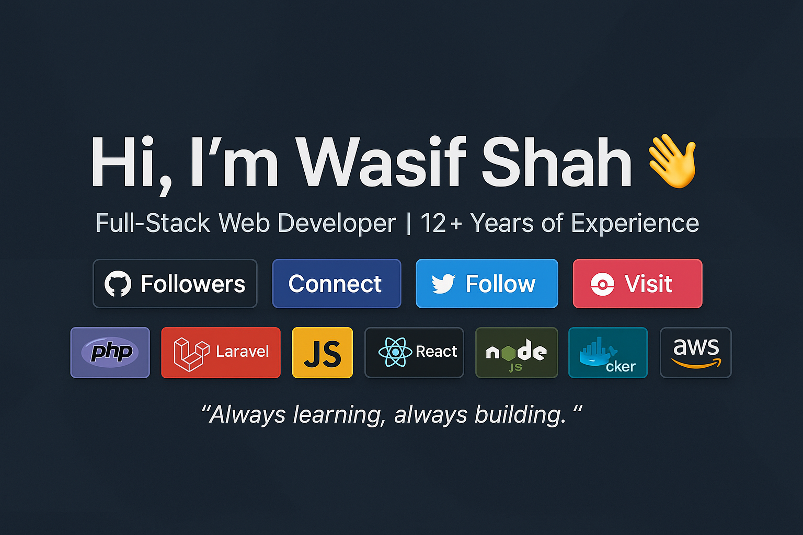

<h1 align="center">Hi, I'm Wasif Shah 👋</h1>
<h3 align="center">Full-Stack Web Developer | 12+ Years of Experience</h3>

  
  
  
  

---

## 🛠 Tech Stack

  
  
  
  
  
  
  
  
  

---

## 📊 GitHub Stats

  
  

---

## 💡 Quote
💡 *"Always learning, always building."*
