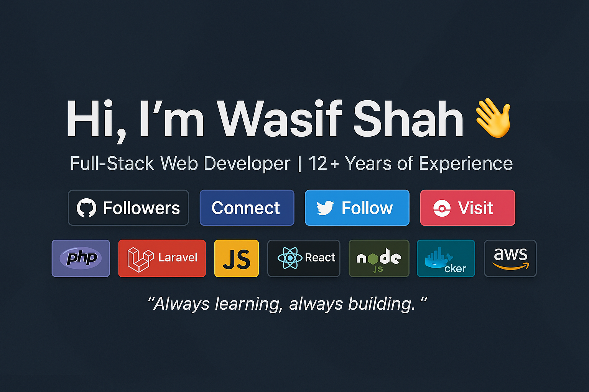

# 👋 Hi, I'm Wasif Shah

💻 **Full-Stack Web Developer** with 12+ years of experience crafting scalable, secure, and high-performance applications.  
I specialize in **PHP**, **MERN**, **Laravel**, **CodeIgniter**, and modern JavaScript frameworks.  

---

## 🚀 What I Do
- 🛠 Build **dynamic web applications** with clean, maintainable code  
- 🗄 Design and optimize **MySQL databases** for performance  
- 🔒 Implement **security-first** architecture in applications  
- ☁ Deploy projects to **AWS**, **Docker**, and modern CI/CD pipelines  

---

## 🏆 Highlights
- 💼 Delivered **enterprise-grade** solutions for international clients  
- 🌐 Developed **multi-tenant SaaS** platforms  
- ⚡ Optimized applications to load in **sub-second speeds**  
- 📈 Contributed to projects with **millions of monthly users**  

---

## 📫 Let’s Connect
- 🌍 [Portfolio](https://xpertsvision.com/portfolio)  
- 💼 [LinkedIn](https://linkedin.com/in/wasishah33)  
- 🐦 [Twitter](https://twitter.com/wasishah33)  

---
💡 *"Always learning, always building."*
